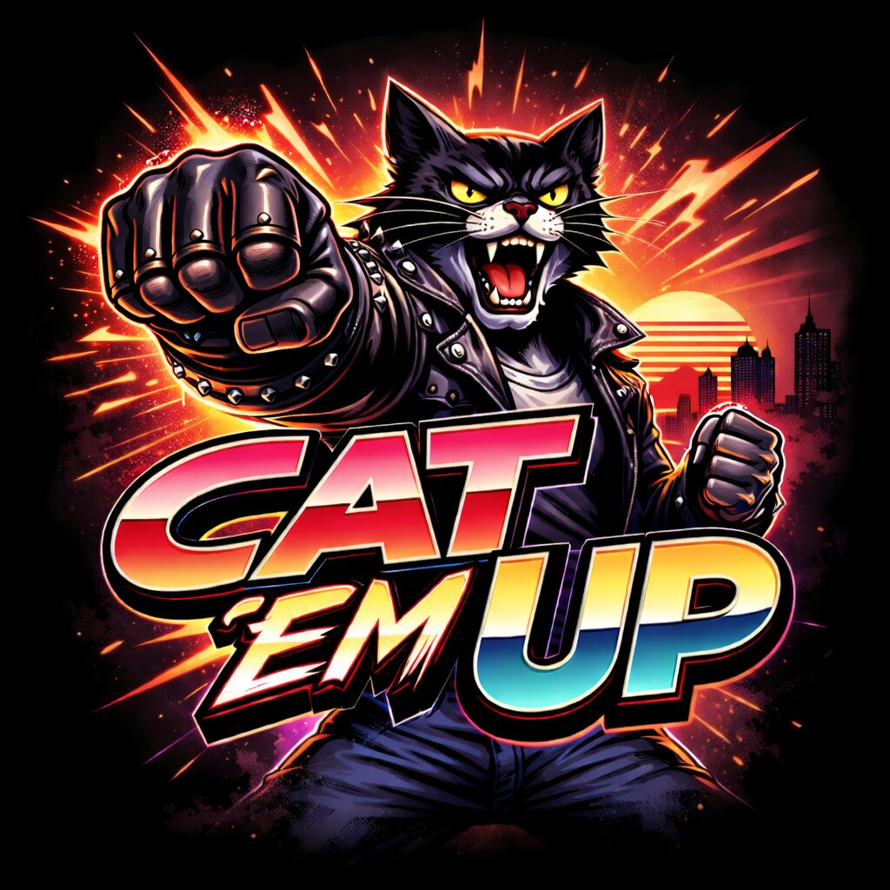
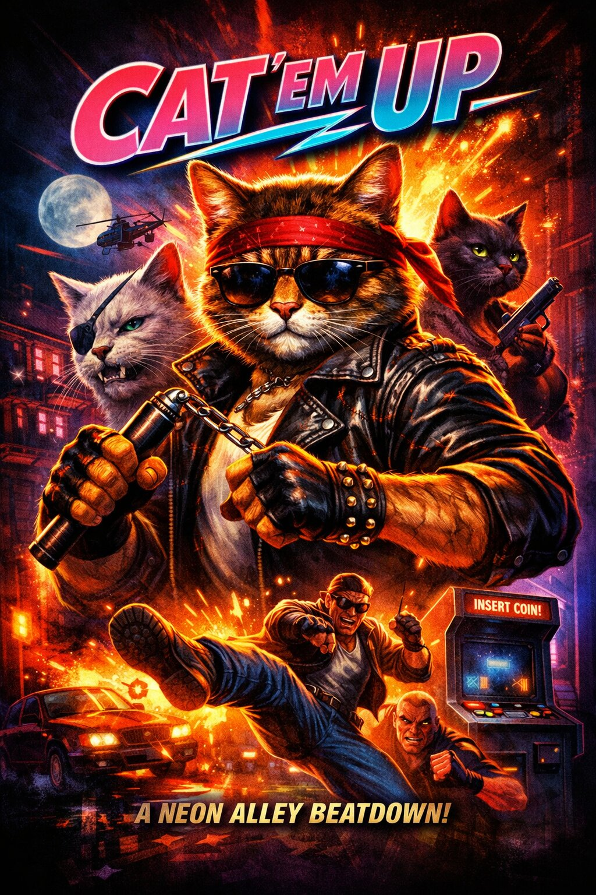

# CAT ’EM UP!

  

  <strong>Insert Coin. Break Bones. Claws Out.</strong>

---

## About

Cat ’Em Up is a high-energy retro 80s neon beat ’em up.

Inspired by arcade cabinets, leather jackets and raw disco-rock energy,  
the game delivers pure side-scrolling street chaos with a feline hero at the center of the fight.

No parody. No meme overload.  
Just neon, impact and arcade intensity.

---

## Vision

- 80s neon aesthetic
- Aggressive disco-rock / synthwave energy
- Arcade cabinet mindset
- Clean engine-agnostic architecture

---

## Tech

- Engine-agnostic deterministic game core
- TypeScript
- Phaser (2D client)
- Three.js (3D client)

---

  

---

Claws out. Game on.
