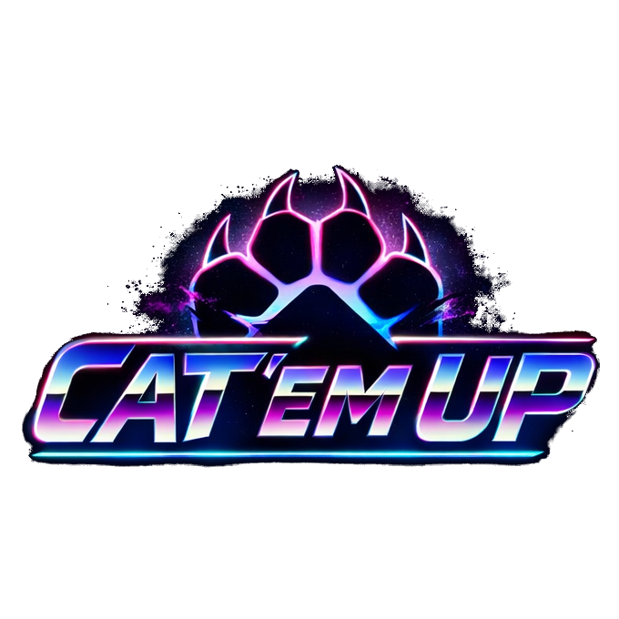
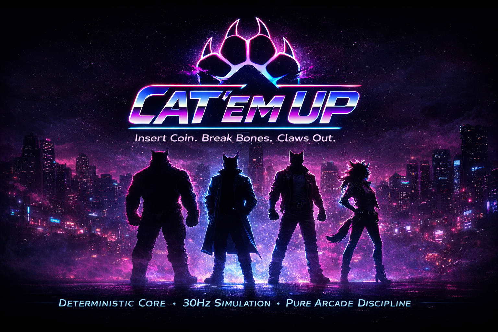

# Cat ’Em Up

  

  <strong>Coin In. Claws Out.</strong>

---

## About

Cat ’Em Up is a high-energy retro 80s neon beat ’em up.

Inspired by arcade cabinets, leather jackets and raw disco-rock energy,  
the game delivers pure side-scrolling street chaos with a feline hero at the center of the fight.

No parody. No meme overload.  
Just neon, impact and arcade intensity.

---

## Vision

- 80s neon aesthetic
- Aggressive disco-rock / synthwave energy
- Arcade cabinet mindset
- Designed as a showcase of clean architecture applied to arcade gameplay

---

## Tech

- Engine-agnostic deterministic game core (30Hz)
- Snapshot + Events rendering model
- Rendering and audio decoupled from game logic
- TypeScript
- Phaser (2D client)
- Three.js (3D client)
- CLI pseudo-graphics client (debug + playable)

---

## Documentation

- [Read the Documentation](docs/00_INDEX.md)

---

  

---

Coin In. Claws Out. Break Bones.
