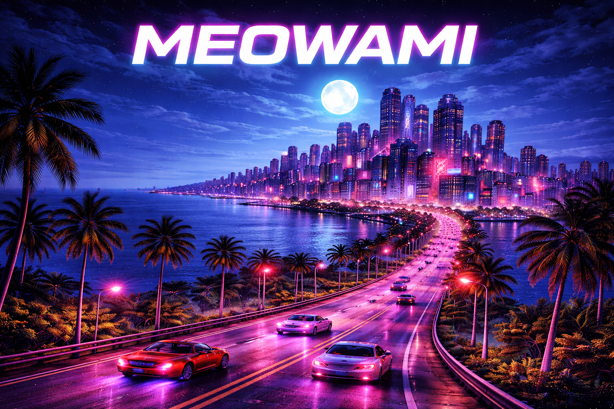

# Meowami City

← [Back to Index](00_INDEX.md)

---

Meowami City is a neon-soaked coastal metropolis where street power defines survival.

Once a glittering entertainment capital, the city has decayed into a layered battlefield of gangs, forgotten districts and crumbling glamour. Night never truly ends here — it only shifts from electric pink to cold blue.

Violence is not chaos.  
It is structure.  
It is territory.  
It is identity.

---

## Tone

- 80s arcade seriousness
- Neon contrast and urban decay
- Stylized, not realistic
- Grit without parody
- Energy without comedy

---

## City Identity

- Dense vertical architecture
- Rooftops, alleys, underground clubs
- Industrial docks and abandoned districts
- Flickering signage and broken streetlights
- Fog mixed with sea air

The city should feel alive — but indifferent.

---

## Narrative Position

The player does not save the city.  
The player survives it.

Meowami is not a backdrop —  
it is pressure.

---

## Future Expansion

This document will later define:

- District structure
- Faction territories
- Environmental storytelling
- Boss locations
- Visual palette rules

---

↑ [Back to top](#top)
