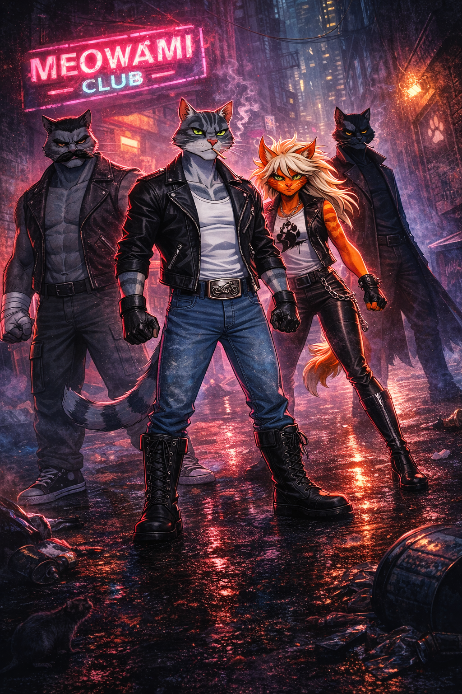

# Characters

← [Back to Index](00_INDEX.md)

---

The core team of Cat ’Em Up operates in Meowami City —  
a neon-soaked urban battlefield where street power defines survival.

Each member represents a distinct combat philosophy and silhouette.  
The roster is intentionally compact and contrast-driven.

---

## Team Poster

---

## Team Overview

- [**Leader — Control / Balance**](16_LEADER.md)
- [**Bruiser — Heavy / Grapple**](17_BRUISER.md)
- [**Blazer — Speed / Pressure**](18_BLAZER.md)
- [**Rogue — Counter / Precision**](19_ROGUE.md)

---

# Team Physical Scale (LOCKED)

Canonical height reference (standing neutral posture, barefoot):

- **Dan (Bruiser)** — 200 cm (6'7")
- **Knoxx (Rogue)** — 190 cm (6'3")
- **Timmy (Leader)** — 180 cm (5'11")
- **Jett (Blazer)** — 170 cm (5'7")

Approximate height in standard footwear (for poster / in-game visual scale reference):

- **Dan** — ~202 cm (6'8")  
  (low-top sneakers, minimal lift)

- **Knoxx** — ~193 cm (6'4")  
  (heavy boots, moderate sole)

- **Timmy** — ~183 cm (6'0")  
  (thick biker boots)

- **Jett** — ~174 cm (5'8.5")  
  (high leather boots with structured sole)

These values are canonical and must remain consistent across all artwork, promotional materials, and in-game representations.

No proportional drift allowed.

---

## Relative Silhouette Rules (CRITICAL)

Height and body mass must read clearly in group compositions.

- **Dan** must always read as the tallest and widest presence.
- **Knoxx** is slightly shorter than Dan but visually elongated due to coat verticality.
- **Timmy** sits at the physical midpoint — balanced in height and build.
- **Jett** is the shortest, but elongated legs and high hair volume prevent her from reading small.

Height difference must remain visible even in dynamic poses.

---

## Group Composition Rules

When characters appear together:

- Dan’s shoulder line must sit clearly above the others.
- Knoxx must visually read taller than Timmy.
- Timmy must never equal Dan in height.
- Jett must never visually match Timmy’s height unless extreme perspective is intentionally used.

Perspective must not flatten height hierarchy accidentally.

---

## Camera Framing Guidelines (Posters & Key Art)

To preserve canonical scale:

- Avoid perfectly level eye-line framing.
- Use slight low-angle framing to reinforce hierarchy.
- Ensure shoulder height differences remain readable.
- Never crop in a way that hides relative scale.

Height hierarchy is part of character identity.

---

## Design Principles

- Strong silhouettes
- Clear combat identity per role
- Minimal dialogue
- Emotion expressed through posture and motion
- Subtle homage strategy without explicit references
- Locked physical scale consistency

---

The team must read instantly in silhouette alone.

Balance.  
Mass.  
Momentum.  
Precision.

---

↑ [Back to top](#top)
