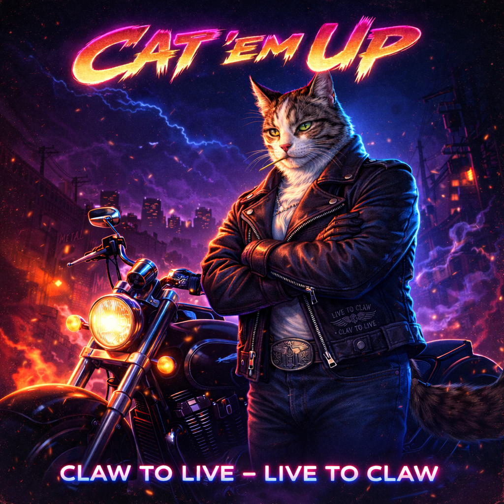

# Leader

← [Back to Characters](15_CHARACTERS.md)

---

  

## Role

Leader

## Working Name

Timmy

## Archetype

Balanced / Control

## Motto

Live to Claw — Claw to Live

## Physical Build

- Athletic, lean frame
- Medium height
- Clearly smaller than Bruiser
- Agile but grounded posture

## Fur & Eyes (Locked)

- Gray tabby pattern
- Dark near-black stripes
- White chest
- White front paws
- White vertical facial stripe
- Subtle dark eye-mask markings
- Deep green eyes

## Visual Identity

- Anthropomorphic street cat
- Clean readable silhouette
- Slight head tilt
- Focused side gaze
- Crossed arms (default poster stance)
- Strong neon rim-light readability

## Outfit

- Black biker leather jacket (full sleeves)
- Full black leather gloves
- Worn jeans
- Large metal belt buckle (motorcycle emblem)
- Toothpick in mouth

## Expression & Presence

- Closed-mouth confident smirk
- Calm, controlled green eyes
- Never rushed
- Poster-hero energy
- “Flash Before Impact” micro-expression

## Symbolism

- Motorcycle association (chopper / cruiser aesthetic)
- Subtle stitched motto inside jacket:
  "Live to Claw — Claw to Live"
- Visual contrast: white chest fur under black leather

## Personality

- Natural center of gravity
- Speaks little, but clearly
- Light irony, never clownish
- Moves with confidence

## Combat Identity

- Clean, efficient strikes
- Balanced speed and power
- Smooth combo flow
- Tactical spacing control
- Precise claw-based finishers

## Design Notes

- Strong readable silhouette
- Emotional storytelling through posture
- Avoid exaggerated parody
- Classic 80s action hero framing
- Neon magenta / cyan rim lighting compatibility

---

↑ [Back to top](#top)
