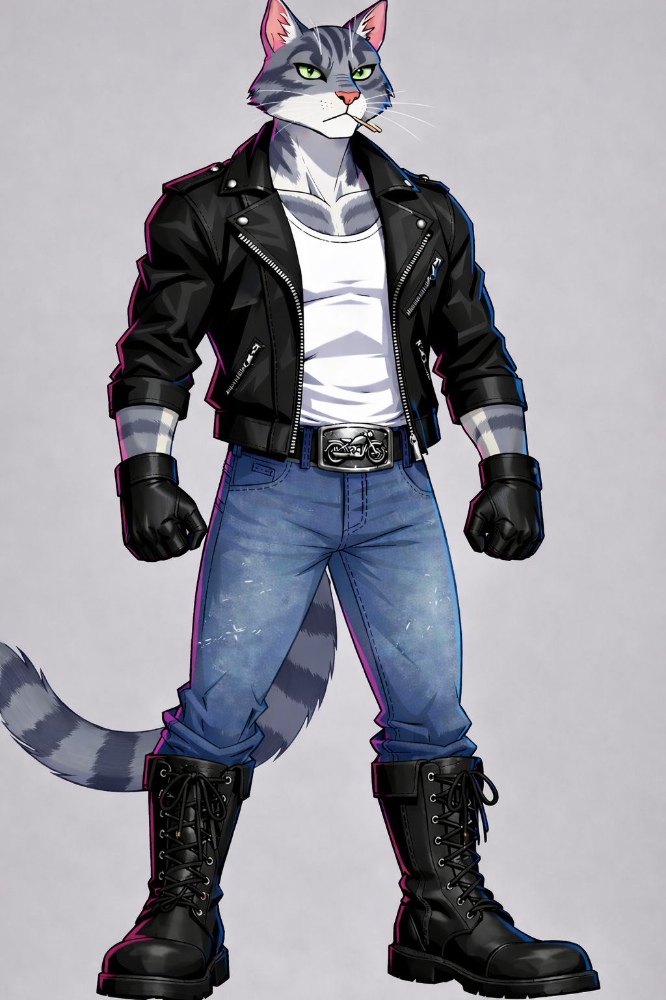
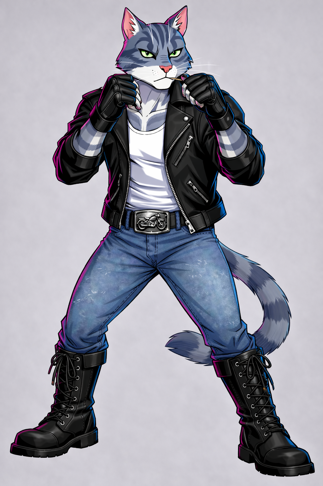
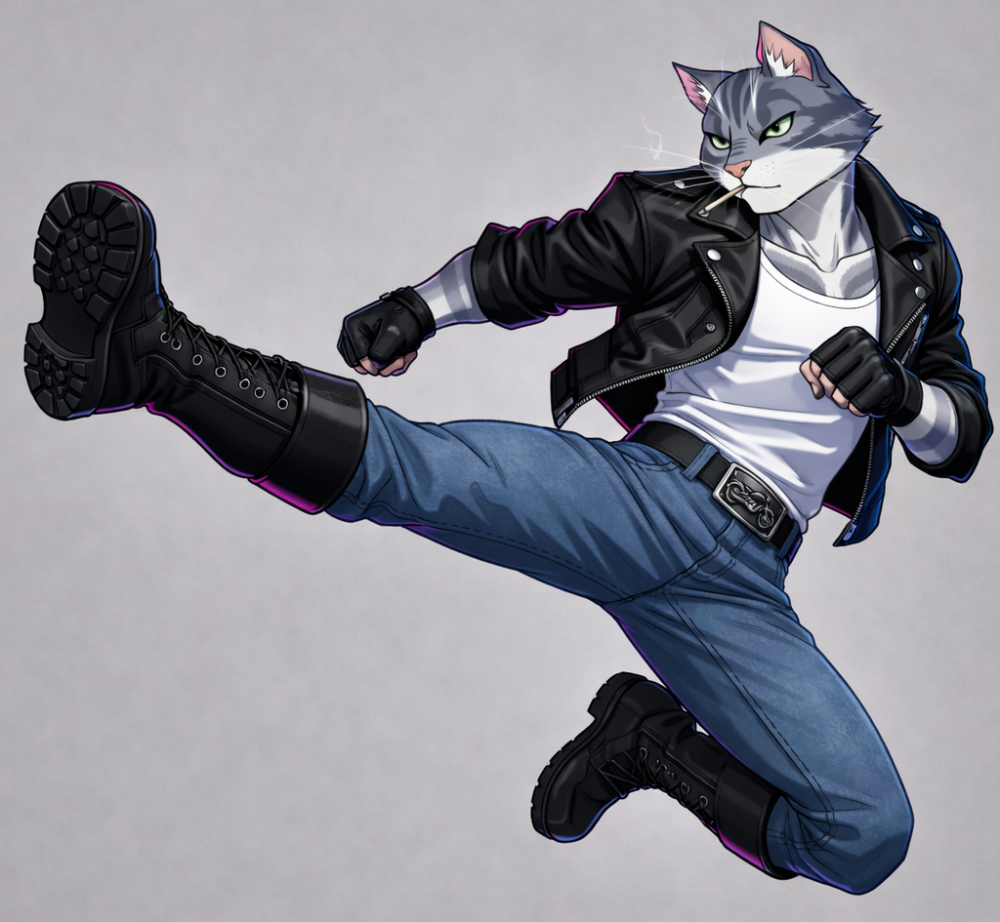
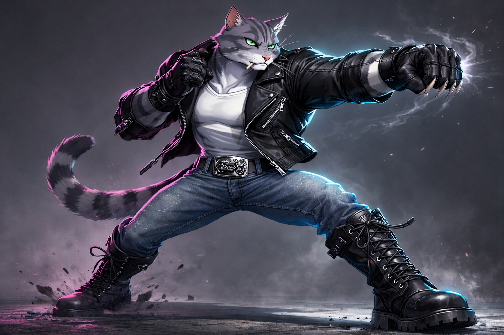

# Leader Visual Lock — Timmy

← [Back](16_LEADER.md)

---

# Purpose

This document defines **immutable visual canon** for Timmy.

All character, narrative, or personality descriptions are handled in  
→ `16_LEADER.md`

If visual interpretation conflicts with other documents,  
**this document takes priority.**

---

  
   
  <b>Primary Canon Reference</b>

---

# Core Visual Identity

Timmy must immediately read as:

- 80s arcade street hero
- Controlled and grounded
- Confident without arrogance
- A biker — not a soldier
- A leader — not a brute

No parody.  
No anime exaggeration.  
No realism drift.

---

# Species & Body Structure

- Anthropomorphic street cat
- Lean athletic build
- Medium height
- Subtle V-taper torso
- Shoulders slightly wider than hips
- Stable grounded posture
- Balanced proportions

Must never appear:

- bulky
- bodybuilder-like
- fashion-model thin
- cartoonishly stylized

---

  
   
  <b>Stance Reference — posture & mass balance</b>

---

# Fur Pattern (LOCKED)

- Base fur: gray tabby
- Stripes: dark near-black
- High contrast readability
- White chest fur
- White front paws
- Clear vertical white facial stripe
- Subtle dark eye-mask markings
- Thick striped tail

The facial stripe must remain clearly readable.

---

# Eyes (LOCKED)

- Deep green color
- Narrow controlled shape
- Calm focused expression

Forbidden:

- yellow tones
- amber tones
- glossy anime highlights
- oversized emotional eyes

Eyes function as identity anchors.

---

# Outfit (LOCKED)

## Jacket

- Black biker leather jacket
- Full sleeves
- Matte to semi-gloss leather
- Clean 80s biker cut
- Minimal hardware
- Strong shoulder silhouette

## Undershirt

- White tank top
- Slightly fitted
- Visible neckline
- Must contrast with chest fur

## Gloves

- Full black leather gloves
- Thick leather material
- Reinforced knuckle area
- Cat paw anatomy readable
- Claws visibly extend beyond fingertips

## Jeans

- Mid-blue worn denim
- Regular fit
- Not skinny
- Light wear texture allowed

## Belt

- Large metal buckle
- Motorcycle / chopper emblem
- Clearly readable shape

## Boots

- Heavy black biker boots
- Thick sole
- Rounded toe
- Strong visual weight

Forbidden:

- tactical military boots
- lightweight sneakers
- futuristic footwear

Timmy is a biker.

---

# Claws (LOCKED)

- Keratin claws
- Slight natural curve
- Clearly readable length
- Visible in idle and combat poses
- Integrated with glove design

Must never appear:

- oversized
- monstrous
- retract completely

Claws are brand anchors.

---

# Head & Expression

Default emotional state:

- Closed-mouth confident smirk
- Controlled jawline
- Slight head tilt allowed

Forbidden:

- exaggerated rage
- wide grin
- comedic expressions
- cute surprise reactions

Emotion = control.

---

# Silhouette Rules

Silhouette readability is mandatory.

Key anchors:

- Jacket defines shoulder line
- Boots anchor lower mass
- Hands read clearly
- Tail visible when framing allows
- Strong pose readability at small scale

Character must remain identifiable in silhouette alone.

---

  
   
  <b>Motion Read — balance during dynamic action</b>

---

# Lighting & Rendering Style

Style Direction: **Neo-Arcade Graphic Realism**

Allowed:

- High contrast lighting
- Magenta rim light
- Cyan rim light
- Clear shadow planes
- Reduced gradient softness

Avoid:

- pastel softness
- mobile-game gloss
- anime cel exaggeration
- hyper-realistic fur rendering
- noisy cyberpunk saturation

---

# Tone Enforcement

Timmy must visually feel:

- Controlled
- Grounded
- Calm before impact
- Dangerous without theatrical aggression

He stabilizes visual chaos.

---

# Non-Negotiable Markers

Every depiction must include:

- Gray tabby fur pattern
- Vertical white facial stripe
- Deep green eyes
- Black biker jacket
- White tank top
- Full black leather gloves
- Visible claws
- Heavy biker boots
- Motorcycle belt buckle

If these markers are missing —  
**the character is not Timmy.**

---

# Canon Compliance Checklist

Before approving artwork:

- [ ] Fur pattern correct
- [ ] Facial stripe readable
- [ ] Eyes deep green
- [ ] Tank top visible
- [ ] Gloves correct
- [ ] Claws visible
- [ ] Boots correct
- [ ] Silhouette readable
- [ ] Tone matches arcade hero identity
- [ ] No anime drift

---

  
   
  <b>Final Combat Anchor — Timmy Signature Read</b>

---

Claws Out.

---

↑ [Back to top](#top)
