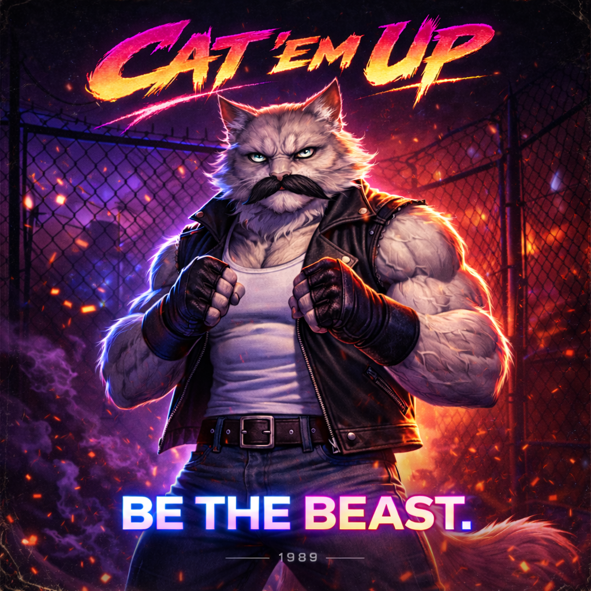

# Bruiser

← [Back to Characters](15_CHARACTERS.md)

---

  

## Role

Bruiser

## Working Name

Dan

## Archetype

Heavy / Wrestler / Old School Fighter

## Motto

Be The Beast

## Physical Build

- Anthropomorphic Maine Coon
- Broad shoulders
- Thick neck
- Massive upper frame
- Dense, compact musculature (not bodybuilder, not bulky — compact power)
- Heavy center of gravity
- Upper body significantly wider than Leader

## Visual Identity

- Light gray fur
- Thick black old-school mustache (short, straight, horizontal)
- Cold gray feline eyes (sharp, narrow pupils)
- Wide grounded fighter stance
- Elbows tight to body, guard up
- Minimal movement

## Outfit

- Black sleeveless leather vest
- White tank top
- Dark worn jeans
- Black wrist wraps
- Simple belt, no decorative elements

## Expression & Presence

- Calm, unreadable face
- No theatrical aggression
- Speaks rarely
- Breathes slow and controlled
- Feels immovable

## Personality

- No theatrics
- No bragging
- Experienced and grounded
- Commands space silently
- Lets impact speak instead of words

## Combat Identity

- Clinch control
- Throws and takedowns
- Crushing knees
- Short-range dominance
- Body pressure and positional control
- Slow but extremely impactful animations
- Every strike feels like weight, not speed

## Design Notes

- Upper-body silhouette priority
- Emphasis on trapezius and neck mass
- Mustache must remain straight and graphic (no curls)
- Movements must feel economical
- Idle stance: classic fighter guard, weight slightly forward
- Old-school combat sports presence without explicit references

---

↑ [Back to top](#top)
