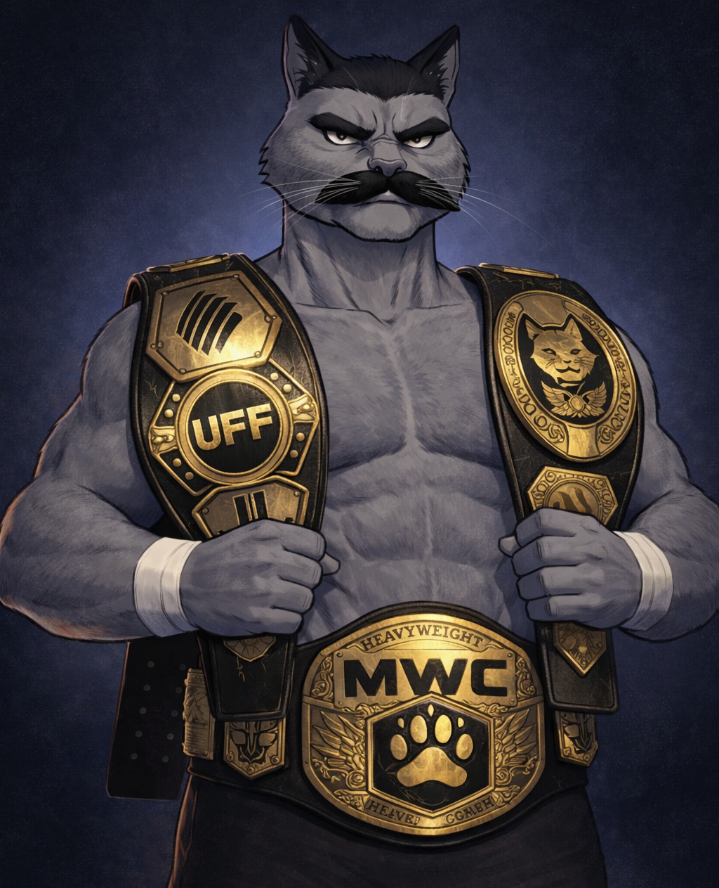

# Bruiser — Dan

← [Back to Characters](15_CHARACTERS.md)

---

## Core Identity

<table>
<tr>
<td width="60%" valign="top">

**Name:** Dan  
**Role:** Bruiser  
**Archetype:** Heavy / Wrestler / Old School Fighter  
**Occupation:** Former National Wrestling Champion  
**Motto:** _Be The Beast_

Dan is the team’s immovable force — the wall that chaos breaks against.

He is not the fastest.  
Not the loudest.  
He is the heaviest presence in the room.

</td>

<td width="40%" align="center">

</td>
</tr>
</table>

---

## Canon Reference

All immutable visual rules are defined here:

→ [Visual Lock — Dan](17_BRUISER_VISUAL_LOCK.md)

This document defines **who Dan is**, not how he must be drawn.

---

## Narrative Role

Dan represents physical certainty.

When fights get crowded,  
when pressure builds,  
when space collapses —

Dan steps forward.

He does not escalate conflict.  
He ends resistance.

He is the team’s anchor point in chaos.

---

## Archetype

**Heavy / Close-Range Dominance**

Design philosophy:

- Control space through presence
- Break rhythm with weight
- Win exchanges at close range
- Force opponents into mistakes

Dan does not chase advantage.

He imposes it.

---

## Personality

Dan speaks rarely.

- No theatrics
- No sarcasm
- No visible ego
- No emotional volatility

He is experienced.  
Grounded.  
Unshakable.

Others create motion.  
Dan creates consequence.

---

## Presence

Dan carries silent authority.

He feels:

- Immovable
- Controlled
- Physically dominant
- Economical in motion

He does not perform strength.

He embodies it.

---

## Combat Identity

Dan’s combat style is built on pressure and weight.

Characteristics:

- Clinch control
- Throws and takedowns
- Crushing knees
- Short-range dominance
- Body pressure and positional control
- Slow but devastating impact animations

Every strike should feel like gravity.

Not speed.

---

## Emotional Tone

Dan represents the moment **after impact**.

The silence when air leaves the room.

The realization that the fight just changed.

He does not rush.

He advances.

---

## Design Intent (High-Level)

Dan should always read as:

- Old-school street fighter presence
- Controlled brutality
- Physical authority
- Minimal expression, maximum consequence

Detailed visual enforcement is handled exclusively by the Visual Lock document.

---

↑ [Back to top](#top)
