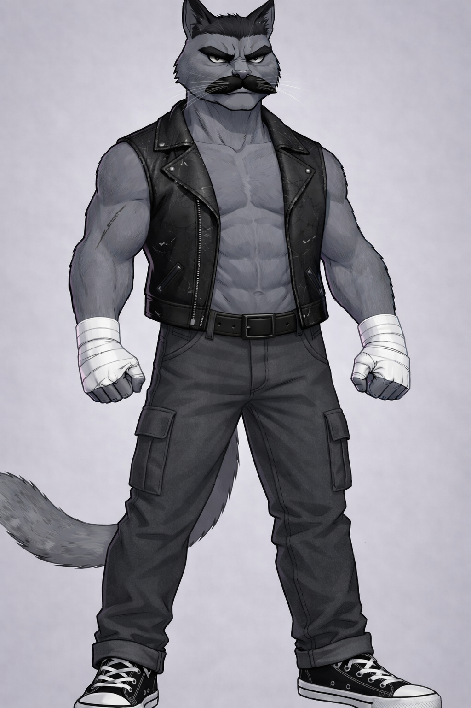
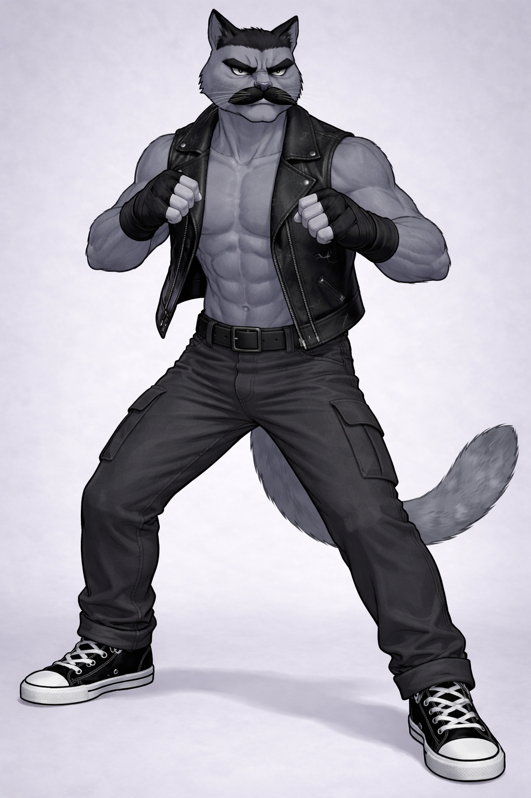
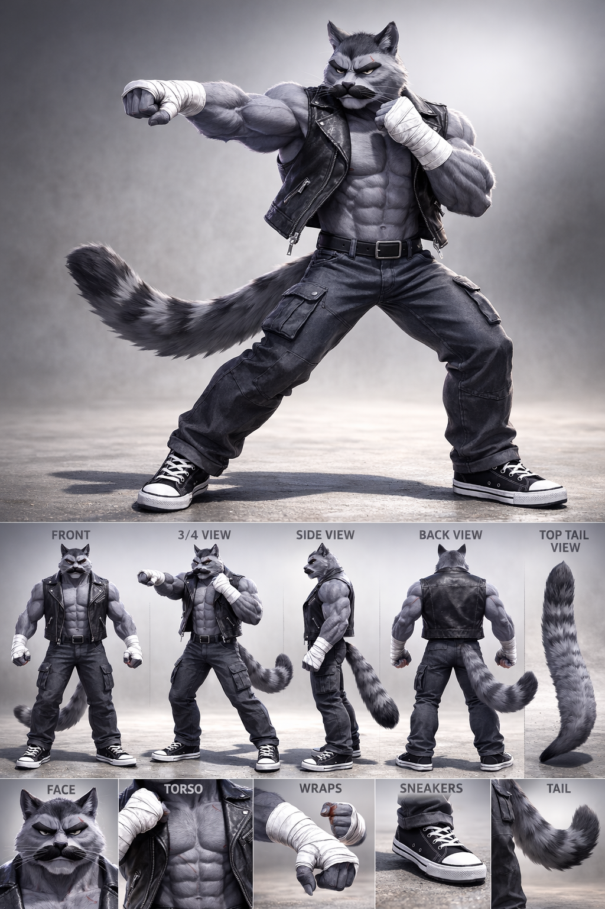
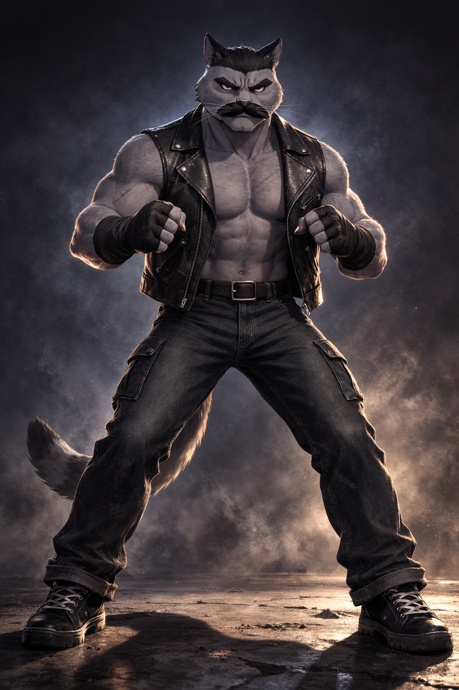

# Bruiser Visual Lock — Dan

← [Back](17_BRUISER.md)

---

# Purpose

This document defines **immutable visual canon** for Dan.

All character, narrative, or personality descriptions are handled in  
→ `17_BRUISER.md`

If visual interpretation conflicts with other documents,  
**this document takes priority.**

---

  
   
  <b>Primary Canon Reference</b>

---

# Core Visual Identity (LOCKED)

Dan must immediately read as:

- Old-school heavyweight street fighter
- Compact, dense power
- Grounded and immovable
- Minimalistic and disciplined
- Visually heavy without exaggeration
- Serious without theatrical aggression

No parody.  
No glam exaggeration.  
No modern MMA drift.  
No wrestling-show flamboyance.

---

<table>
<tr>
<td width="55%" valign="top">

# Species & Body Structure (LOCKED)

- Anthropomorphic Maine Coon
- Broad shoulder line
- Thick neck and trapezius mass
- Upper body significantly wider than hips
- Dense compact musculature
- Visible abs but not shredded bodybuilder detail
- Heavy center of gravity
- Slight forward weight bias in stance

Must never appear:

- Over-cut bodybuilding anatomy
- Soft or overweight
- Slender or agile
- Stylized fashion proportions
- Cartoonishly exaggerated limbs

He is dense. Not bulky.

</td>

<td width="45%" align="center">

</td>
</tr>
</table>

---

# Fur (LOCKED)

- Base fur: ash gray
- Subtle Maine Coon texture
- No stripes
- No high-contrast patterns
- Graphic rendering, not hyper-realistic

Tone must remain controlled and matte.

---

# Eyes (LOCKED)

- Cold gray tone
- Narrow pupils
- Sharp, focused gaze
- Low emotional expressiveness

No warmth.  
No glow.  
No anime gloss.

Eyes must feel calculating.

---

<table>
<tr>
<td width="45%" align="center">

</td>

<td width="55%" valign="top">

# Facial Structure & Marks (LOCKED)

- Thick black straight mustache
- Short length
- Straight horizontal silhouette
- Clean graphic edges
- No tapering ends
- No curls
- No volume exaggeration

Additional identity markers:

- Massive heavy eyebrows
- Slight brow ridge emphasis
- Small scar across one eyebrow

If the mustache changes shape —  
the character identity breaks.

</td>
</tr>
</table>

---

# Outfit (LOCKED)

## Vest

- Black sleeveless leather vest
- Matte worn finish
- Light surface scratches allowed
- Clean biker cut
- No studs
- No chains

## Undershirt

None.  
Chest is exposed.

## Pants

- Dark charcoal cargo pants
- Functional side pockets
- Regular fit

## Wrist Wraps

- White boxing wraps
- Tight and functional
- Slight wear texture allowed

## Belt

- Simple black belt
- Plain buckle

---

# Footwear (LOCKED)

- Classic black low-top sneakers
- White rubber toe cap
- White sole edge

No boots.  
No tactical footwear.

---

# Silhouette Rules (CRITICAL)

Dan must read instantly in silhouette.

Primary anchors:

- Wide upper torso
- Thick neck mass
- Straight mustache bar
- Broad eyebrow line
- Sleeveless vest cut
- Cargo pocket shapes
- Stable planted stance

Compared to team:

Leader = balanced  
Bruiser = widest  
Blazer = elongated  
Rogue = vertical

Dan must read as the widest presence.

---

# Stance Rules

Default idle stance:

- Feet planted
- Weight forward
- Elbows slightly bent
- Fists tight
- Minimal movement
- No bouncing

He does not warm up.  
He waits.

---

# Motion Language

Movement must feel:

- Economical
- Heavy
- Short-range
- Crushing

Avoid:

- Spin-heavy attacks
- Agile flips
- Flashy wind-ups

Dan shifts weight like gravity.

---

# Tone Enforcement

Dan must visually communicate:

- Authority
- Stability
- Experience
- Physical consequence

He is not angry.  
He is inevitable.

---

# Non-Negotiable Markers

Every depiction must include:

- Maine Coon build
- Ash gray fur
- Thick straight black mustache
- Heavy eyebrows
- Small eyebrow scar
- Sleeveless black leather vest
- Exposed torso
- Dark cargo pants
- White boxing wraps
- Black sneakers
- No undershirt

If these are missing —  
the character is not Dan.

---

# Canon Compliance Checklist

- [ ] Upper body clearly widest in team
- [ ] Mustache straight and graphic
- [ ] Eyebrow mass present
- [ ] Scar subtle and readable
- [ ] Vest matte and worn
- [ ] Cargo pockets visible
- [ ] White wraps present
- [ ] Sneakers correct
- [ ] No glam drift
- [ ] Tone matches disciplined heavyweight presence
- [ ] No undershirt present

---

  
   
  <b>Clinch. Control. Consequence.</b>

---

↑ [Back to top](#top)
