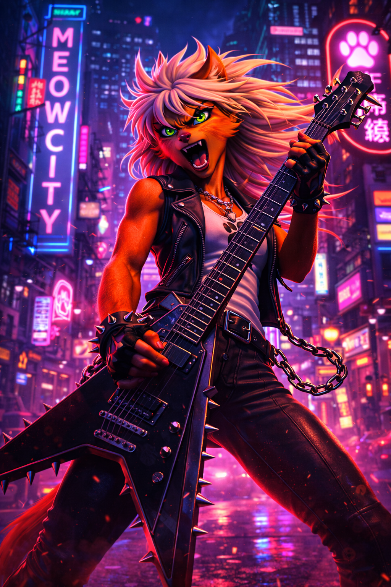

# Blazer — Jett

← [Back to Characters](15_CHARACTERS.md)

---

## Core Identity

<table>
<tr>
<td width="60%" valign="top">

**Name:** Nova Jett  
**Role:** Blazer  
**Archetype:** Speed / Pressure / Voice of Resistance  
**Motto:** _Claws Out_

Jett is ignition.

She does not wait for momentum.  
She creates it.

She does not follow energy.  
She amplifies it.

If Leader controls rhythm  
and Bruiser enforces weight —  
Blazer turns sparks into fire.

</td>

<td width="40%" align="center">

</td>
</tr>
</table>

---

## Who She Is

Before the streets,  
there was a stage.

Jett is a rock vocalist of Meowami City.  
Her voice filled underground clubs.  
Her lyrics carried coded defiance.  
Her name traveled faster than police sirens.

When corruption tightened its grip,  
she did not retreat into music.

She weaponized it.

Her concerts became gathering points.  
Her choruses became signals.  
Her presence became ignition.

She did not set out to lead a resistance.

She became its pulse.

---

## Narrative Role

Jett represents escalation.

She transforms hesitation into action.  
She transforms tension into motion.  
She transforms motion into pressure.

In the team dynamic:

- Leader stabilizes
- Bruiser anchors
- Rogue corrects
- Blazer advances

She is not reckless.

She is fearless.

And fearlessness is contagious.

---

## Archetype

**Speed / Pressure Fighter**

Design philosophy:

- Forward momentum as identity
- Tempo as a weapon
- Relentless advance
- Strike chains that build rhythm
- Aggression through movement

Jett grows stronger while pushing forward.

Stopping is not her instinct.

Acceleration is.

---

## Personality

Jett is expressive and unapologetic.

- High energy
- Direct and blunt
- Charismatic without vanity
- Fierce without hysteria
- Emotionally loud — strategically aware

She enjoys the spotlight.  
But she earns it.

Her presence is not performance.

It is declaration.

---

## Presence

Blazer feels explosive.

She is:

- Electrified
- Forward-leaning
- Kinetic
- Uncontained
- Loud without losing control

Where Dan is gravity,  
Jett is ignition.

Where Knoxx waits,  
Jett moves.

She does not calm storms.

She becomes them.

---

## Combat Identity

Her combat style mirrors her stage presence.

Characteristics:

- High mobility
- Fast strike chains
- Aerial pressure
- Rhythm-driven offense
- Momentum amplification
- Relentless forward push

Her strength is not raw power.

It is tempo.

Every fight feels like a guitar solo —  
fast, aggressive, escalating.

---

## Emotional Tone

Blazer represents the moment **during impact**.

Flash.  
Heat.  
Noise.  
Motion.

She is not the calm before the storm.

She is the storm with a microphone in one hand  
and a clenched fist in the other.

---

## Design Intent (High-Level)

Blazer must always read as:

- 80s metal energy without parody
- A rock frontwoman turned street catalyst
- Fierce and intense, not comedic
- Speed embodied
- Controlled aggression, not chaos
- The audible voice of resistance

Detailed visual enforcement is handled exclusively by the Visual Lock document.

---

↑ [Back to top](#top)
