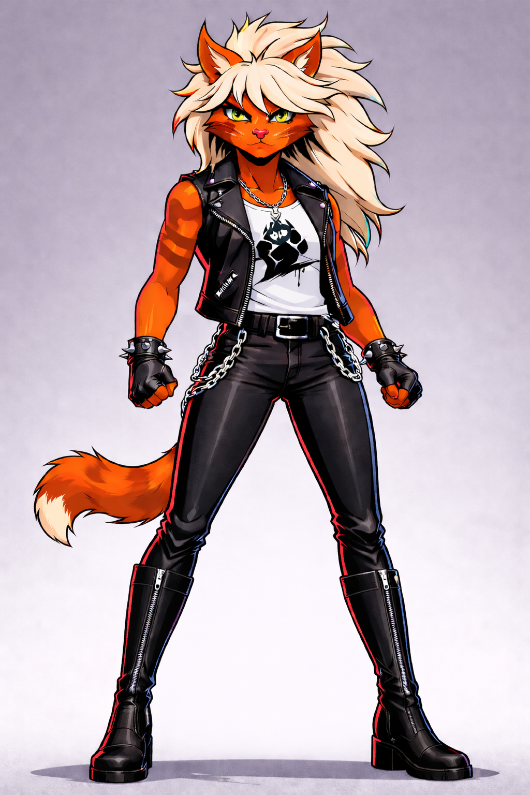
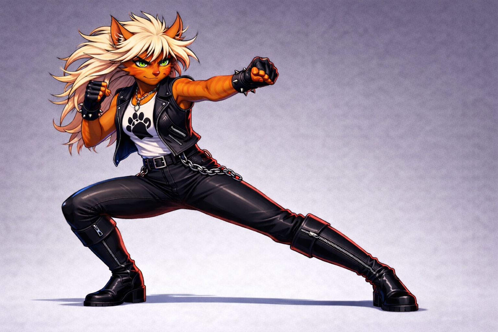
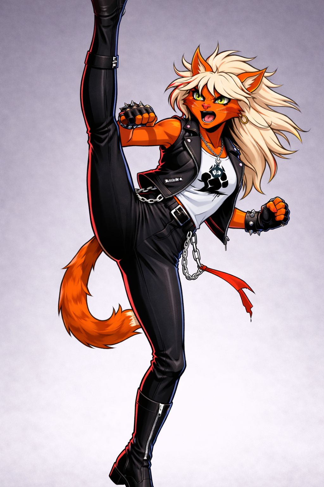
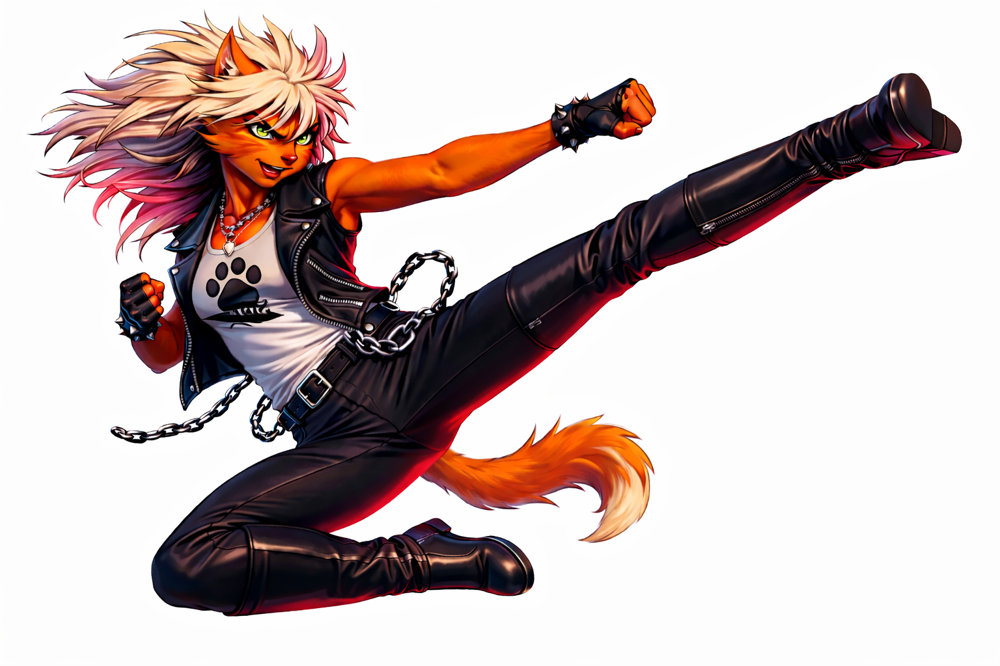
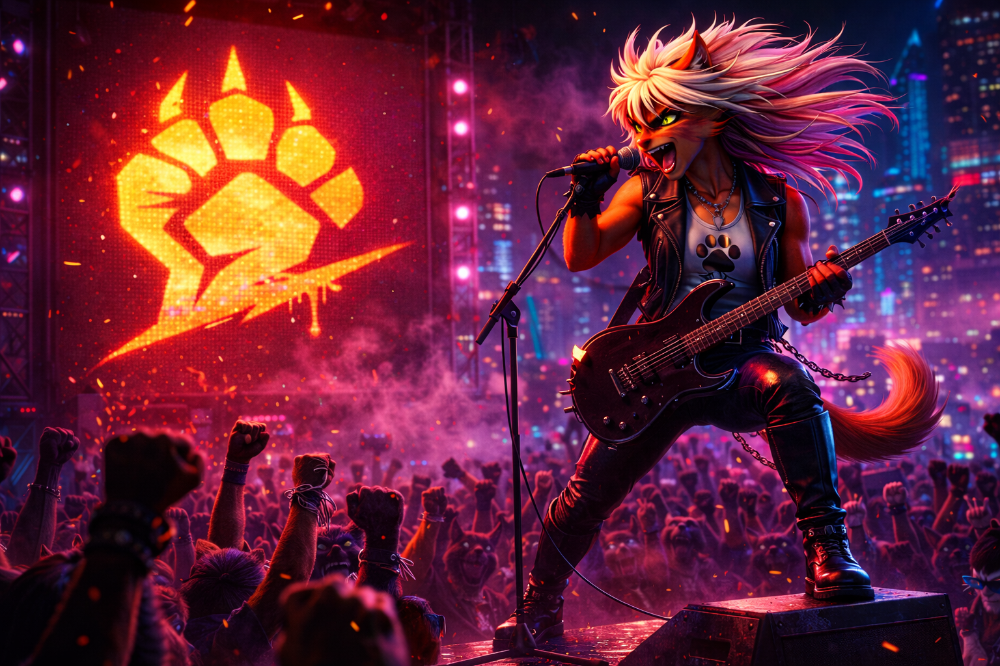

# Blazer Visual Lock — Jett

← [Back](18_BLAZER.md)

---

# Purpose

This document defines **immutable visual canon** for Jett.

All character, narrative, or personality descriptions are handled in  
→ `18_BLAZER.md`

If visual interpretation conflicts with other documents,  
**this document takes priority.**

---

  
   
  <b>Primary Canon Reference</b>

---

# Core Visual Identity (LOCKED)

Jett must immediately read as:

- Rock frontwoman energy
- Street-level resistance icon
- Lean, speed-oriented fighter
- Stage presence turned combat presence
- Fierce without glam exaggeration
- Electrified momentum

She is not a fashion model.  
She is not a pop idol.  
She is not parody metal.

She is ignition with intent.

---

<table>
<tr>
<td width="55%" valign="top">

# Species & Body Structure (LOCKED)

- Lean athletic feline build
- Long leg line
- Narrow waist
- Defined but lightweight musculature
- Elongated dynamic silhouette
- Forward kinetic bias in stance

Must never appear:

- Over-sexualized
- Bodybuilder muscular
- Fragile or delicate
- Stylized fashion exaggeration
- Cartoonishly distorted proportions

She is acceleration — not fragility.

</td>

<td width="45%" align="center">

</td>
</tr>
</table>

---

# Fur (LOCKED)

- Red-orange base tone
- Copper warmth under lighting
- No striping patterns
- Clean graphic color blocking

Rendering rules:

- Graphic clarity over realism
- Avoid pastel drift
- Avoid excessive gradient softness
- Avoid hyper-textured fur

Her color must feel hot.  
Not cute.

---

# Hair (NON-NEGOTIABLE)

- Platinum blonde
- High volume
- Wild 80s stage energy
- Strong silhouette readability
- Motion-reactive shape

Forbidden:

- Perfect fashion styling
- Anime spike exaggeration
- Soft glam curls
- Short cuts

Hair must feel like it moves even in still frames.

It amplifies momentum.

---

# Eyes (LOCKED)

- Sharp feline structure
- Predatory focus
- Controlled intensity
- Neon-reactive under rim lighting

Forbidden:

- Innocent softness
- Cute sparkle
- Heavy glam gloss
- Idol-style expressiveness

Her gaze must challenge.

Not invite.

---

<table>
<tr>
<td width="45%" align="center">

</td>

<td width="55%" valign="top">

# Outfit (LOCKED)

## Pants

- Tight black leather
- Clean silhouette
- No bright color inserts
- No fashion rips
- No glam overstylization

## Vest

- Sleeveless black leather
- Subtle metal studs
- Structured fit
- Not oversized

## Shirt

- White base
- Cat resistance symbol centered
- Graphic clarity required

## Belt & Chains

- Functional metal chains
- Motion accent only
- No excessive layering

## Gloves

- Fingerless
- Dark tone
- Functional

## Boots

- High black leather boots
- Strong vertical read
- Zipper detail
- No platform exaggeration

Forbidden:

- Glitter
- Neon pink drift
- Cyberpunk over-detail
- Glam parody metal

</td>
</tr>
</table>

---

# Makeup (CONTROLLED)

- Dark stage eye emphasis
- Subtle but readable
- Must enhance intensity

No lipstick focus.  
No beauty-styling emphasis.

Intensity, not cosmetics.

---

# Silhouette Rules (CRITICAL)

Jett must read instantly in silhouette.

Primary anchors:

- High-volume wild hair
- Long leg line
- Narrow waist
- Forward lean
- Chain motion accents
- Boot verticals

Compared to team:

Leader = balanced  
Bruiser = widest  
Blazer = elongated  
Rogue = vertical

Jett must always read as the most dynamic.

---

# Motion Language

Movement must feel:

- Snapping
- Fast
- Elastic
- Rhythmic
- Relentless

Avoid:

- Floaty animation
- Ballet grace
- Circus acrobatics
- Comedic exaggeration

Speed must feel dangerous.

Every strike should feel like a guitar riff —  
tight, sharp, escalating.

---

  

---

# Tone Enforcement

Jett must communicate:

- Heat
- Rhythm
- Challenge
- Escalation
- Stage dominance

She performs through combat.

Not through posing.

She does not entertain.

She overwhelms.

---

# Non-Negotiable Markers

Every depiction must include:

- Red-orange fur
- Platinum wild hair
- Lean elongated build
- Sleeveless leather vest
- White shirt with resistance symbol
- Black leather pants
- Functional chains
- Fingerless gloves
- High black boots

If these are missing —  
the character is not Blazer.

---

# Canon Compliance Checklist

Before approving artwork:

- [ ] Hair silhouette strong
- [ ] Fur color correct
- [ ] Build lean and elongated
- [ ] No glam parody drift
- [ ] Motion reads fast
- [ ] Silhouette distinct from Leader
- [ ] Tone intense, not comedic
- [ ] Chains present but controlled
- [ ] Boots correct
- [ ] No over-sexualization

---

  
   
  <b>Ignite. Advance. Overwhelm.</b>

---

↑ [Back to top](#top)
