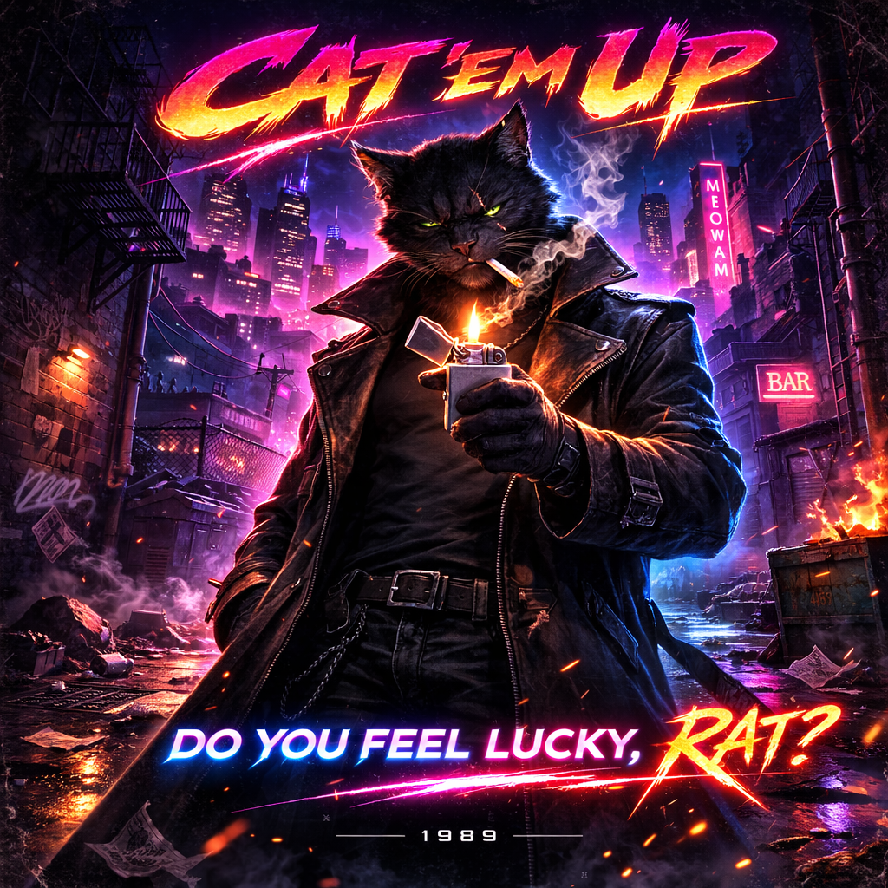

# Rogue — Knoxx

← [Back to Characters](15_CHARACTERS.md)

---

## Core Identity

<table>
<tr>
<td width="60%" valign="top">

**Name:** Knoxx  
**Role:** Rogue  
**Archetype:** Counter / Precision / Timing  
**Occupation:** Private Detective  
**Motto:** _Do you feel lucky?_

Knoxx is restraint.

He does not rush into fights.  
He lets fights reveal themselves.

Where Blazer ignites  
and Bruiser presses —  
Rogue waits.

</td>

<td width="40%" align="center">

</td>
</tr>
</table>

---

## Canon Reference

All immutable visual rules are defined here:

→ [Visual Lock — Rogue](19_ROGUE_VISUAL_LOCK.md)

This document defines **who Knoxx is**, not how he must be drawn.

---

## Who He Is

Knoxx is a licensed private detective in Meowami City.

He works the cases the Hounds ignore.  
He digs into corruption the Pigs conceal.  
He tracks movements the Rats think are invisible.

He knows the city from rooftops to docks.  
From neon clubs to dead-end alleys.

He does not trust institutions.

He trusts patterns.

---

## Narrative Role

Knoxx represents experience.

He is the oldest of the four.  
He has seen escalation.  
He has survived it.

He does not dominate space.  
He dominates timing.

He allows opponents to overcommit —  
and then he corrects them.

Permanently.

---

## Archetype

**Counter / Precision Fighter**

Design philosophy:

- Punish-first philosophy
- Enhanced parry timing
- Controlled spacing
- Single decisive impact

Knoxx does not trade blows.

He ends exchanges.

---

## Personality

Knoxx is dry, controlled, and analytical.

- Surgical sarcasm
- Rarely impressed
- Speaks quietly
- Observes before acting
- Occasionally undercuts Leader — never publicly

He does not seek attention.

He seeks efficiency.

---

## Presence

Rogue feels still.

He is:

- Vertical
- Balanced
- Minimal in motion
- Always measuring distance

He looks at opponents  
like they are already a solved equation.

---

## Combat Identity

Knoxx thrives on precision.

Characteristics:

- Enhanced parry window
- Focus-based counter system
- Damage spikes after perfect timing
- Strong single-hit impact
- Short slow-motion moment on perfect counter
- Calm idle before explosive response

He does not build momentum.

He builds inevitability.

---

## Focus Mechanic

Focus accumulates when:

- Not attacking
- Maintaining defensive stance
- Successfully blocking

Full Focus enables:

- Guaranteed critical counter
- Stronger knockback
- Brief cinematic slowdown

Focus rewards patience.

---

## Emotional Tone

Rogue represents the moment **after a mistake**.

Silence.  
Correction.  
Finality.

He does not rage.

He calculates.

---

## Design Intent (High-Level)

Rogue must always read as:

- Veteran presence
- Controlled menace
- Precision over aggression
- Discipline over drama
- 80s street anti-hero without cliché
- Noir private detective energy

Detailed visual enforcement is handled exclusively by the Visual Lock document.

---

↑ [Back to top](#top)
