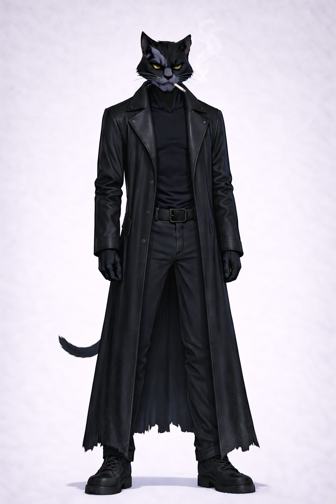
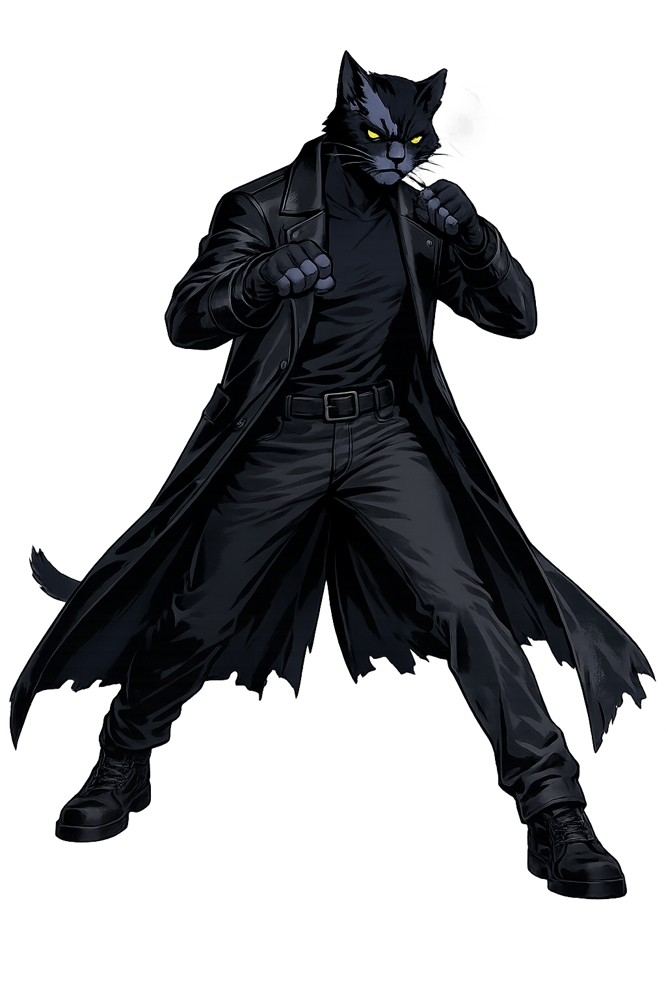
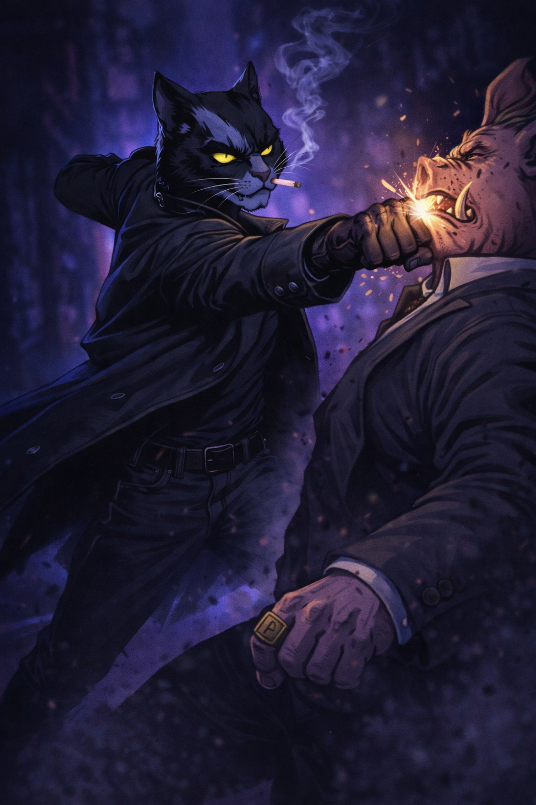
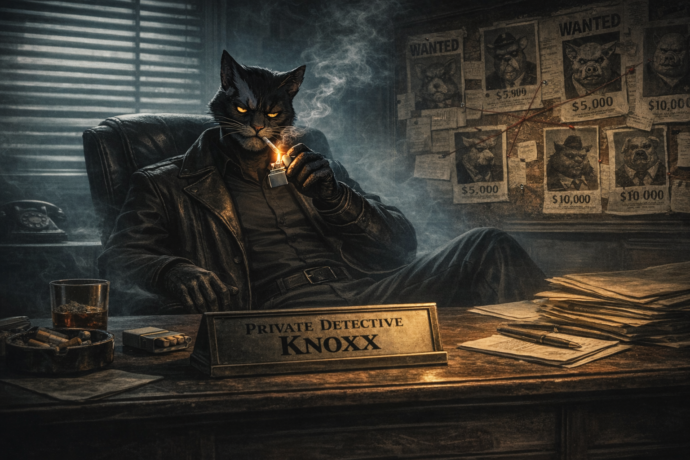

# Rogue Visual Lock — Knoxx

← [Back](19_ROGUE.md)

---

# Purpose

This document defines **immutable visual canon** for Knoxx.

All character, narrative, or personality descriptions are handled in  
→ `19_ROGUE.md`

If visual interpretation conflicts with other documents,  
**this document takes priority.**

---

  
   
  <b>Primary Canon Reference</b>

---

# Core Visual Identity

Knoxx must immediately read as:

- 80s street anti-hero
- Veteran presence
- Vertical and composed
- Controlled danger
- Stillness before precision
- Crime-drama seriousness

No ninja clichés.  
No gothic exaggeration.  
No edgy fashion drift.  
No anime stylization.

He is restraint.

---

# Species & Body Structure (LOCKED)

- Black anthropomorphic cat
- Lean hardened build
- Slightly taller than Leader
- Narrow but stable stance
- Long vertical posture
- Minimal mass exaggeration
- Tight controlled proportions

Must never appear:

- Bulky
- Bodybuilder muscular
- Fragile
- Slouched excessively
- Stylized fashion-thin
- Anime-proportioned

He is disciplined, not dramatic.

---

  
   
  <b>Stance Reference — vertical balance & restraint</b>

---

# Fur (LOCKED)

- Deep matte black
- Subtle cold-blue rim under neon lighting
- No striping
- No gray drift
- No hyper-detail texture

Rendering must prioritize graphic clarity.

Avoid:

- Gloss shine
- Wet highlights
- Fur strand realism
- Gradient softness

Black must read as confident negative space.

---

# Distinguishing Marks (NON-NEGOTIABLE)

- Torn left ear
- Thin scar across left cheekbone
- Sharp piercing yellow eyes
- Permanent half-squint

These are identity anchors.

Removing them breaks recognition.

---

# Eyes (LOCKED)

- Sharp yellow tone
- Narrow pupils
- Evaluating gaze
- Low emotional expression

Forbidden:

- Red glow
- Wide emotional eyes
- Cute expressions
- Anime shine
- Dramatic rage exaggeration

Eyes must feel analytical.

---

# Coat (PRIMARY SILHOUETTE ANCHOR)

- Long structured leather coat
- Knee-length minimum
- Matte graphite or midnight black
- Heavy shoulder line
- Clean vertical fall
- Minimal seam noise
- No exaggerated flare

Forbidden:

- Hood
- Cape-like movement
- Trenchcoat parody drama
- Excess straps
- Tactical overload

The coat must feel heavy.

It moves slowly.

---

# Outfit (LOCKED)

## Shirt

- Dark fitted shirt
- No visible logos
- No bright contrasts
- Minimal surface noise

## Trousers

- Narrow combat-style pants
- Dark tone
- Functional fit
- No fashion rips
- No stylized tailoring

## Gloves

- Simple leather gloves
- Dark matte finish
- Functional, not flashy

## Boots

- Heavy black boots
- Strong grounded silhouette
- No futuristic shapes
- No glam details

## Signature Prop

- Classic metal flip lighter
- Small
- Subtle
- Not oversized

No jewelry.  
No chains.  
No studs.  
No tactical cosplay.

---

# Head & Expression

Default state:

- Slight downward head tilt
- Half-squint
- Tight jawline
- Minimal expression

Forbidden:

- Smirking
- Snarling
- Wide rage
- Comedy faces

Emotion = control.

---

# Silhouette Rules (CRITICAL)

Knoxx must read instantly in silhouette.

Primary anchors:

- Long vertical coat line
- High collar shape
- Slight forward head tilt
- Narrow stance width
- Clean shoulder profile

Compared to team:

Leader = balanced  
Bruiser = widest  
Blazer = elongated  
Rogue = vertical and composed

Knoxx must always read as the cleanest vertical silhouette.

---

# Motion Language

Movement must feel:

- Minimal
- Economical
- Efficient
- Controlled
- Precise

Avoid:

- Flashy spins
- Dramatic coat explosions
- Acrobatic excess
- Stylized anime pauses
- Over-choreographed theatrics

He wastes no motion.

---

  
   
  <b>Counter Anchor — precision over force</b>

---

# Lighting & Rendering Style

Style Direction: **Neo-Arcade Crime Realism**

Allowed:

- High contrast
- Cyan rim lighting
- Magenta neon reflections
- Hard shadow planes
- Graphic lighting clarity

Avoid:

- Pastel softness
- Mobile-game gloss
- Cyberpunk overload
- Hyper-realistic fur
- Overly cinematic blur

He should feel carved from shadow.

---

# Tone Enforcement

Knoxx must visually communicate:

- Experience
- Calculation
- Precision
- Quiet threat
- Veteran composure

He is not mysterious.

He is measured.

---

# Non-Negotiable Markers

Every depiction must include:

- Deep black fur
- Torn left ear
- Facial scar
- Yellow eyes
- Long leather coat
- Vertical silhouette
- Minimal accessories

If these markers are missing —  
**the character is not Rogue.**

---

# Canon Compliance Checklist

Before approving artwork:

- [ ] Coat length correct
- [ ] Ear tear visible
- [ ] Scar readable
- [ ] Yellow eyes sharp
- [ ] Silhouette vertical
- [ ] No ninja drift
- [ ] No gothic over-stylization
- [ ] Motion economical
- [ ] Tone controlled
- [ ] Reads as veteran anti-hero

---

  
   
  <b>Wait. Measure. Correct.</b>

---

↑ [Back to top](#top)
