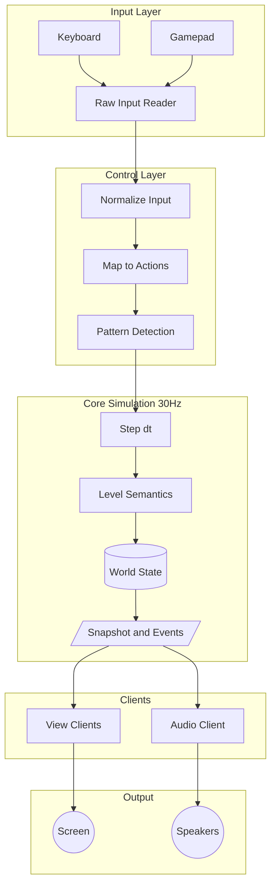
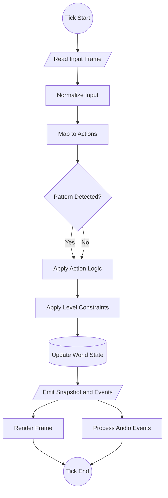

# Architecture

← [Back to Index](00_INDEX.md)

## System Architecture

```mermaid
flowchart TB

  subgraph INPUT[Input Layer]
    KB[Keyboard]
    GP[Gamepad]
    RAW[Raw Input Reader]
  end

  subgraph CONTROL[Control Layer]
    NORM[Normalize Input]
    MAP[Map to Actions]
    PAT[Pattern Detection]
  end

  subgraph CORE[Core Simulation 30Hz]
    STEP[Step dt]
    LEVEL[Level Semantics]
    WORLD[(World State)]
    SNAP[/Snapshot and Events/]
  end

  subgraph CLIENTS[Clients]
    VIEW[View Clients]
    AUDIO[Audio Client]
  end

  subgraph OUTPUT[Output]
    SCREEN((Screen))
    SPEAKERS((Speakers))
  end

  KB --> RAW
  GP --> RAW
  RAW --> NORM
  NORM --> MAP
  MAP --> PAT
  PAT --> STEP

  STEP --> LEVEL
  LEVEL --> WORLD
  WORLD --> SNAP

  SNAP --> VIEW
  SNAP --> AUDIO

  VIEW --> SCREEN
  AUDIO --> SPEAKERS
```

## Simulation Tick Flow

```mermaid
flowchart TB

  START((Tick Start))

  INPUT[/Read Input Frame/]
  NORMALIZE[Normalize Input]
  MAP[Map to Actions]

  DECISION{Pattern Detected?}

  APPLY[Apply Action Logic]
  LEVEL[Apply Level Constraints]
  UPDATE[(Update World State)]

  SNAP[/Emit Snapshot and Events/]

  RENDER[Render Frame]
  AUDIO[Process Audio Events]

  END((Tick End))

  START --> INPUT
  INPUT --> NORMALIZE
  NORMALIZE --> MAP
  MAP --> DECISION

  DECISION -->|Yes| APPLY
  DECISION -->|No| APPLY

  APPLY --> LEVEL
  LEVEL --> UPDATE
  UPDATE --> SNAP

  SNAP --> RENDER
  SNAP --> AUDIO

  RENDER --> END
  AUDIO --> END
```

↑ [Back to top](#top)
